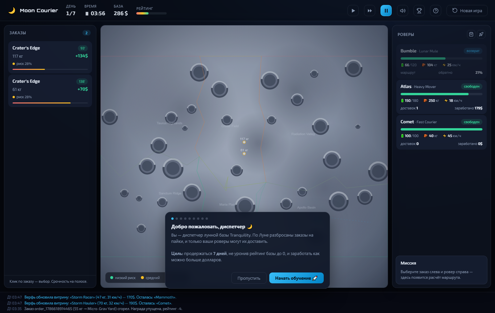

# 🌙 Moon Courier Simulator

Небольшой игровой симулятор доставки пайков по Луне. Игрок — диспетчер базы: отправляет роверы по карте, следит за весом груза, батареей и риском маршрута, зарабатывает кредиты и держит рейтинг базы.

Цель — **продержаться 7 дней**, не уронив рейтинг базы до 0, и заработать максимум долларов.

---

## Запуск

Требуется **Python 3.10+** (без внешних зависимостей, только стандартная библиотека).

```bash
cd moon-delivery
python server.py            # http://localhost:8000
# или на другом порту:
python server.py 8137
```

Откройте в браузере **http://localhost:8000** — игра начинается сразу. Кнопка «?» в шапке — справка с правилами, 🏆 — таблица лидеров. При первом входе запускается **интерактивный онбординг**: он подсвечивает панели и просит реально выбрать заказ, ровер и запустить доставку. Имя пилота для таблицы лидеров вводится при завершении партии (победа или закрытие базы).

Быстрый старт в Windows: двойной клик по `start.bat`.

Сохранение — автоматическое в `data/*.json`. Новая игра — кнопка «Новая игра» или `POST /api/cmd {"cmd":"reset"}`.

## Проверка решения (тесты)

```bash
python tests/smoke.py     # 11 дымовых тестов ключевой логики, ~0.1 c
```

Покрывают: целостность мозаики зон (нет «дыр»), форпосты в своих зонах, маршруты не проходят сквозь кратеры, зоны различаются по риску/скорости, отклонение невозможных миссий (перегруз, нехватка батареи, буря, занятый ровер), полный цикл доставки (деньги/батарея/статусы) и штраф за опоздание. Тесты не трогают сохранение (`save_all` заменён заглушкой). Именно они поймали реальный баг топологии мира (микро-«дыры» на границе двух зон), после чего генератор был исправлен.

---

## Скриншоты

| Игровой экран (карта Луны, заказы, роверы) |
|---|
|  |

Карта Луны рисуется процедурно: случайный мир каждой партии — 6 зон с ломаными границами и 32 кратера, ночь/день, роверы с кольцом батареи, точки заказов на карте, маршруты с объездом препятствий.

---

## Как играть

1. Выберите заказ в левой панели (точка на карте) и свободного ровера в правой.
2. Панель «Миссия» покажет оценку: дистанцию, время, энергию, награду — и предупредит, если что-то не так.
3. 🚀 Запустить доставку. Ровер едет, на него действуют события по риску зоны.
4. Вовремя — полная награда (+2 рейтинга), опоздание — половина (−4 рейтинга), просрочка — заказ сгорает (−4).
5. Следите за батареей: заряжайте на базе (ночью медленнее) или «Быстрой зарядкой» за кредиты.
6. 🛰 — флот: улучшения роверов. 🛒 — верфь: новые модели.
7. Три кнопки времени в шапке: ▶ — обычная скорость (×1), ⏩ — ускорение (×5), ⏸ — пауза. «Новая игра» — сброс.

> Наведите курсор на заказ в списке — на карте подсветится, куда его доставлять.

---

## Логика веса / батареи / риска

### Вес
- У каждого заказа есть `weight_kg`, у ровера — `cap_kg`.
- Запуск отклоняется, если **вес > грузоподъёмность** («Вес груза превышает грузоподъёмность»).
- Тяжёлый груз **увеличивает расход энергии**: `энергия/км = base_e + kw * weight`. Тяжёлые заказы требуют или тяжёлого ровера (Atlas), или аккуратного планирования.

### Батарея
- Требуемая энергия считается по полному маршруту **туда и обратно** через зоны (`path_profile`).
- Если `требуется > заряд ровера` — старт запрещён («Не хватит батареи»). Это обе стороны: проверка на старте + живая трата во время поездки.
- Расход во время пути: батарея убывает пропорционально пройденной дистанции **по фазам** (в путь / обратно), с множителем энергозатрат зоны.
- Зарядка — только на базе (`idle` рядом с базой): 7 Вт·ч/мин днём, 3 ночью. Платная «Быстрая зарядка» — 1 $ за 2 Вт·ч.
- Если батарея упала до 0 в пути — ровер **застрял**: заказ возвращается в очередь, рейтинг −8, эвакуация за кредиты (или ждать).

### Риск зоны
Каждая зона имеет `risk`, `speed` (множитель скорости) и `energy`:
- Maria Plain — безопасная равнина (риск 0.06).
- Crater Field — кратерные поля: медленно и энергозатратно.
- Taurus Highlands — горы: риск и бонус к награде.
- Radiation Valley — радиационная долина: самый высокий риск и награда.
- Sanctum Ridge / Apollo Basin — спокойные окраины.

Чем выше риск, тем чаще «события» в пути: пыль (лишний расход), ЭМИ (−12 Вт·ч), повреждение привода (−35% скорости), зажатая ось (доп. время), радиационные вспышки. Всё это добавляется в журнал событий.

**Маршруты с объездом**: путь рассчитывается по карте (A*) с обходом кратеров и зон, перекрытых бурями, — роверы не едут «сквозь» препятствия.

**Случайный мир**: каждая партия генерирует новую мозаику из 6 зон (общие ломаные границы, без «дыр») и 32 кратера — карта не повторяется. 1 игровой день ≈ 12 реальных минут (`GAME_MIN_PER_SEC = 2`).

**Бури**: случайная зона периодически перекрывается — маршруты туда блокируются («Зона заказчика перекрыта бурей...»), заказы в этой зоне недоступны до конца бури.

### Сценарии «доставка невозможна»
1. **Тяжёлый заказ** (например 260 кг) — тяжелее любого ровера, выполнить нельзя, заказ сгорает.
2. **Зона под бурей** (на старте Radiation Valley перекрыта бурей) — туда нельзя.
3. **Не хватает батареи** — тяжёлый груз на дальнюю точку легкому роверу (запуск отклонён).

### Очки
- `credits`: награда за доставку (+5% за «точно вовремя»), минус за быструю зарядку, эвакуацию.
- `rating` (0–100, старт 80): +2 вовремя, −4 опоздание / просрочка, −8 застрявший ровер, −3 эвакуация. Рейтинг 0 → база закрыта (game over).
- Финал после 7 дней: счёт = `кредиты + рейтинг × 30`.

### Флот и улучшения
Кнопка 🛰 (или кнопка «?» в туториале → шаг про флот) открывает панель `showFleet`:
- **Улучшения** каждого ровера за кредиты: `up_kg` (+12 кг, уровни 40/75/120/180 $), `up_batt` (+18 Вт·ч, 35/65/110/170 $), `up_speed` (+4 км/ч, 30/55/90/140 $). Улучшать можно только свободный ровер на базе.
- **Верфь**: витрина из 4 случайных моделей — грузоподъёмность, батарея, скорость, цена и требуемое число доставок генерируются с ростом вашего прогресса. Каждые 10–20 игровых минут витрина ротируется (два слота за раз), после покупки витрина пополняется новой моделью. Купленные роверы получают уникальные id (можно покупать повторно разные экземпляры).
- Улучшенная скорость учитывается в `estimate_mission` (пересчёт `path_profile`); энергозатраты — через `kw`/`base_e` без изменений.

---

## Где что хранится

| Файл `data/*.json`      | Содержимое                                                                 |
|-------------------------|----------------------------------------------------------------------------|
| `rovers.json`           | Роверы: батарея, грузоподъёмность, скорость, положение, статус, статистика |
| `orders.json`           | Активные/завершённые заказы: вес, награда, срок, зона, статус              |
| `deliveries.json`       | История доставок: заказ, ровер, направление, награда, время, события       |
| `events.json`           | Журнал событий (хазарды, бури, миссии, доставки)                           |
| `state.json`            | Кредиты, рейтинг, день/время, бури, статус игры                            |

Конфигурация мира (зоны, база, роверы, баланс) — константы в `server.py` (можно править для баланса). Запись — атомарная (временный файл + replace) раз в секунду и по каждому действию. Чтение — из памяти, файлы — точка восстановления между перезапусками.

## API (для интеграций)

- `GET /api/state` — всё состояние игры (карта, заказы, роверы, события).
- `POST /api/cmd` `{cmd, payload}` — `launch`, `rush_charge`, `recover`, `fast_forward`, `reset`.

---

## Что сделано и что использовано из AI

- Полностью самодостаточная браузерная игра: канвас-карта Луны (случайный мир: зоны, кратеры, точки заказов, роверы с кольцом батареи, ночь/день), панели заказов и роверов, оценка миссии, журнал событий, справка, экран финала с вводом имени и таблицей лидеров (топ-10 в localStorage).
- **Звук и музыка**: полностью синтезируются в браузере (Web Audio API, без файлов) — клики, запуск доставки, прибытие/опоздание, бури, хазард-события, покупки, фанфары победы/проигрыша и фоновая музыкальная петля. Кнопка 🔊 в шапке — выключить/включить (запоминается).
- Бэкенд — Python stdlib (HTTP + фоновая симуляция + хранилище JSON).
- Сгенерировано opencode (AI-ассистент): архитектура, вся логика симуляции, интерфейс и текст. Числа баланса подобраны вручную и проверены автоматическими тестами (`tests/smoke.py, 11 проверок) и прогоном сценариев (вес, батарея, буря, застрявший ровер, game over). Случайная генерация мира (зоны-мозаика, кратеры) — собственная процедурная логика.

## Ассеты и лицензии

| Ассет | Источник | Лицензия |
|---|---|---|
| `public/assets/exo-*.woff2` | шрифт Exo 2 | **SIL Open Font License 1.1** |
| `public/assets/orbitron-lat.woff2` | шрифт Orbitron | **SIL Open Font License 1.1** |

Шрифты вложены в репозиторий — игра работает офлайн. Карта Луны рисуется процедурно (космос, моря, кратеры со светом, виньетирование) — без внешних ассетов.